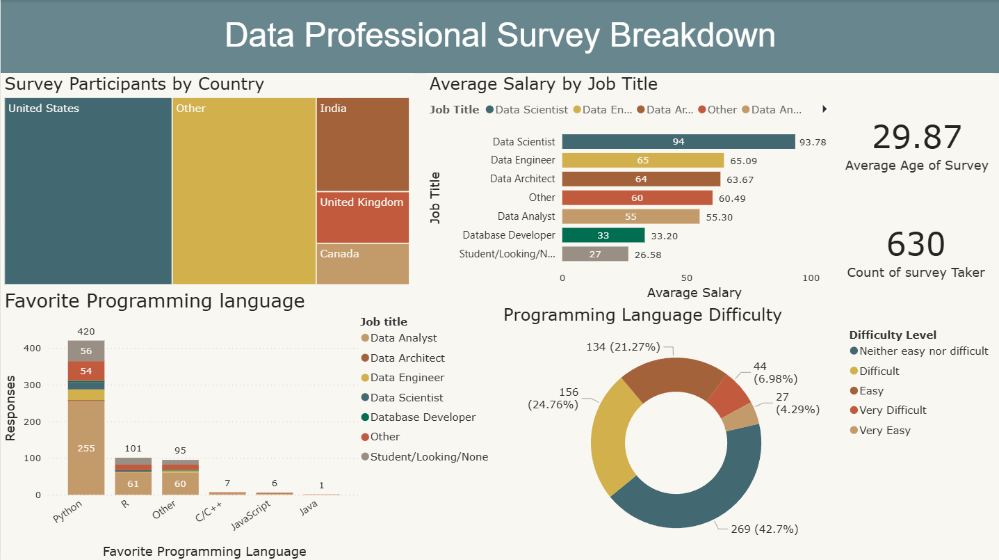

# Data Professional Survey (Power BI)
# Data Professional Survey Dashboard
Power BI | Data Visualization | DAX | Power Query | Data Modeling

An interactive Power BI dashboard analyzing survey responses from data professionals.
# 📊 Power BI - Data Professional Survey Dashboard

## 📌 Overview
This project is an interactive Power BI dashboard built using a Data Professional Survey dataset. The dashboard provides insights into survey participants' salaries, programming language preferences, job priorities, demographics, and career feedback.

## 🛠️ Tools & Technologies
- Power BI Desktop
- Power Query
- DAX
- Data Modeling

## 📊 Dashboard Preview

## 📈 Dashboard Insights
- Survey Participants by Country
- Average Salary by Job Title
- Favorite Programming Language
- Programming Language Difficulty
- Average Age of Survey Participants
- Total Survey Participants

## 🧹 Data Cleaning
The dataset was cleaned and transformed using Power Query:
- Removed unnecessary columns
- Renamed columns for better readability
- Corrected data types
- Handled missing values
- Prepared the data model for reporting

## 📂 Project Files
- `Data Professional Survey.pbix`
- `Dashboard.png`

## 🎯 Skills Demonstrated
- Data Cleaning
- Data Transformation
- Data Modeling
- DAX Measures
- Data Visualization
- Dashboard Design

## 👤 Author

**Abdul Rehman**

GitHub: https://github.com/abdulrehman-tp
